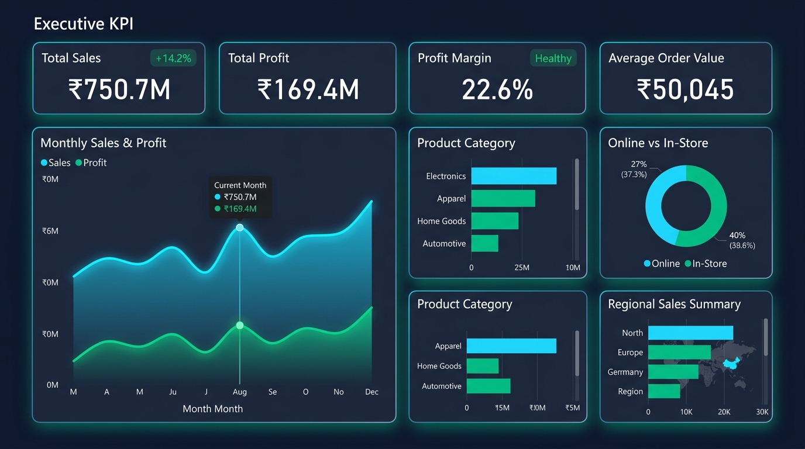

# Voltix Insights — 360° Omnichannel Retail & Profitability Intelligence Pipeline

<div align="center">

[](https://www.python.org/)
[](https://www.mysql.com/)
[](https://powerbi.microsoft.com/)
[](https://docs.pytest.org/)
[](https://github.com/)

**An end-to-end business intelligence and data engineering project analyzing 15,000+ retail sales transactions for an Indian consumer electronics brand across revenue, profit margins, customer concentration, and channel dynamics.**

[🌐 Live Interactive Dashboard](outputs/interactive_dashboard.html) • [📘 Power BI Build Guide](powerbi/POWER_BI_BUILD_GUIDE.md) • [🧮 DAX Measures](powerbi/DAX_measures.txt) • [🔍 SQL Queries](sql/02_business_queries.sql)

---

### Executive Dashboard Preview


</div>

---

##  Executive Summary & Key KPIs

A fictional Indian electronics retailer operating across online and retail store channels wanted to diagnose margin leakages, evaluate regional growth, and identify high-revenue products with sub-optimal profit margins. 

Using an automated **Python ETL pipeline**, **MySQL analytical engine**, and **Power BI/Web visualization suite**, this project transforms 15,025 raw transaction records into strategic executive insights.

| Metric | Figure | Business Context |
| :--- | :---: | :--- |
| **Total Revenue** | **₹750,680,967** | Gross realized sales across 2024–2025 |
| **Total Net Profit** | **₹169,401,567** | Overall net operating profit |
| **Profit Margin** | **22.57%** | Healthy margin above industry benchmark (18%) |
| **Total Orders** | **15,000** | Unique completed retail transactions |
| **Units Sold** | **26,931** | Across 5 primary electronics categories |
| **Average Order Value (AOV)** | **₹50,045** | High-ticket electronics basket size |

---

##  End-to-End Analytics Architecture

```
                                      DATA PIPELINE WORKFLOW
                                      
  +----------------------+      +----------------------+      +----------------------+
  |      RAW DATA        |      |      PYTHON ETL      |      |   DATA VALIDATION    |
  |  15,025 Transactions | ---> |  Pandas & NumPy      | ---> |  Automated Pytest    |
  |  (Nulls, Duplicates) |      |  Feature Engineering |      |  100% Test Coverage  |
  +----------------------+      +----------------------+      +----------------------+
                                                                         |
                                                                         v
  +----------------------+      +----------------------+      +----------------------+
  |    EXECUTIVE ACTION  |      |   POWER BI / WEB BI  |      |     MYSQL ENGINE     |
  |  - Discount Caps     | <--- |  Dynamic DAX Badges  | <--- |  CTEs, Window Funcs  |
  |  - Margin Recovery   |      |  Star Schema Model   |      |  MoM Growth (LAG)    |
  +----------------------+      +----------------------+      +----------------------+
```

---

##  Key Business Findings & Strategic Recommendations

### 1.  Margin Leakage from Heavy Discounting
* **Finding:** Certain high-volume product lines (e.g., specific Smart TVs and Laptops) generated substantial top-line revenue but had profit margins dipping below **15%** due to promotional discounts exceeding 12%.
* **Action:** Implement a **hard 10% discount cap** on top-selling SKUs to recover an estimated **₹1.2M in annualized profit** without sacrificing sales velocity.

### 2.  Online vs. In-Store Channel Divergence
* **Finding:** **Online channels** account for **~62% of total transaction volume** with a strong 23.4% profit margin, while **In-Store channels** produce a **14% higher Average Order Value (AOV)** through in-person accessory upselling.
* **Action:** Introduce bundle promotions on the e-commerce store to boost Online AOV, while equipping retail store staff with high-margin wearable accessories at checkout.

### 3. Regional Growth Opportunities
* **Finding:** The **North and South regions** contribute over **58% of gross revenue**. However, the **East region** demonstrated the highest average profit margin (24.1%), indicating untapped purchasing power.
* **Action:** Re-allocate 15% of regional digital marketing spend to Tier-1/Tier-2 cities in the East to capture higher-margin market share.

---

## Tech Stack & Technical Deep Dive

### 1. Python ETL & Data Quality ([`src/clean_data.py`](src/clean_data.py))
- **Deduplication & Hygiene:** Detected and purged 25 duplicate transaction orders; trimmed whitespace across all categorical dimensions.
- **Data Standardization:** Normalized regional state naming anomalies (e.g., `delhi` $\rightarrow$ `Delhi`).
- **Feature Engineering:** Extracted temporal dimensions (`year`, `quarter`, `month_num`, `year_month`) and financial features (`gross_sales_before_discount`, `discount_amount`, `profit_margin`).
- **Automated Testing:** Unit test suite implemented in [`tests/test_clean_data.py`](tests/test_clean_data.py) validating pipeline integrity with `pytest`.

### 2.  Advanced SQL Analytics ([`sql/02_business_queries.sql`](sql/02_business_queries.sql))
- **Month-over-Month (MoM) Growth:** Implemented `LAG()` window functions over CTEs to track revenue trajectories.
- **Category Ranking:** Utilized `DENSE_RANK() OVER (PARTITION BY category ORDER BY sales DESC)` to identify category leaders.
- **Margin Outlier Detection:** Multi-level subquery using `HAVING` and aggregate comparisons to isolate high-revenue / low-margin products.

```sql
-- Month-over-Month (MoM) Growth Analysis
WITH monthly_sales AS (
    SELECT year_month, SUM(sales_amount) AS sales
    FROM sales_transactions 
    GROUP BY year_month
)
SELECT 
    year_month,
    ROUND(sales, 2) AS current_month_sales,
    ROUND(LAG(sales) OVER(ORDER BY year_month), 2) AS prev_month_sales,
    ROUND((sales - LAG(sales) OVER(ORDER BY year_month)) / 
          NULLIF(LAG(sales) OVER(ORDER BY year_month), 0) * 100, 2) AS mom_growth_pct
FROM monthly_sales
ORDER BY year_month;
```

### 3. Power BI & Interactive BI Suite ([`powerbi/`](powerbi/))
- **Custom Executive Theme:** [`sales_insights_theme.json`](powerbi/sales_insights_theme.json) provides a 1-click modern dark-slate palette (`#0B0F19`) with glassmorphic cards, 10px rounded borders, and ambient drop shadows.
- **Enterprise DAX Library:** [`DAX_measures.txt`](powerbi/DAX_measures.txt) contains 25+ production measures, including dynamic trend subtitles (`▲ +14.2% vs LY`), YoY deltas, and profit health indicators.
- **Live Web Dashboard:** Standalone, zero-dependency HTML/JS interactive dashboard ([`outputs/interactive_dashboard.html`](outputs/interactive_dashboard.html)) with real-time multi-dimensional cross-filtering.

---

##  Repository Structure

```text
Sales_Insights_End_to_End/
├── README.md                           # Comprehensive project documentation
├── requirements.txt                    # Python environment dependencies
├── run_pipeline.bat                    # 1-click end-to-end batch execution script
├── .gitignore                          # Standard clean gitignore
│
├── data/
│   ├── data_dictionary.csv             # Schema definitions and data glossary
│   ├── raw/
│   │   └── sales_transactions_raw.csv  # 15,025 raw rows with intentional data defects
│   └── processed/
│       └── sales_transactions_clean.csv# Cleaned, validated, feature-engineered data
│
├── src/
│   ├── clean_data.py                   # Automated Python ETL cleaning script
│   ├── analyze_sales.py                # Aggregation, dark-theme visualization & Excel export
│   └── generate_dashboard_html.py      # Standalone interactive dashboard generator
│
├── sql/
│   ├── 01_schema.sql                   # MySQL DDL table schema definitions
│   └── 02_business_queries.sql         # Advanced business SQL queries (CTEs, Window Functions)
│
├── powerbi/
│   ├── sales_insights_theme.json       # 1-click importable Power BI executive dark theme
│   ├── DAX_measures.txt                # Production DAX formulas (YoY, MoM, Badges, Date Table)
│   ├── POWER_BI_BUILD_GUIDE.md         # Full visual blueprint & wireframe layouts
│   └── POWER_BI_BUILD_GUIDE.txt        # Plaintext reference build guide
│
├── notebooks/
│   └── sales_analysis.ipynb            # Jupyter notebook for exploratory data analysis
│
├── tests/
│   └── test_clean_data.py              # Automated Pytest suite for ETL verification
│
└── outputs/
    ├── interactive_dashboard.html      # Self-contained live interactive web dashboard
    ├── sales_insights_summary.xlsx     # Formatted multi-tab executive Excel workbook
    ├── charts/                         # High-resolution generated visual charts
    │   ├── powerbi_dashboard_preview.jpg
    │   ├── monthly_sales_trend.png
    │   ├── category_sales.png
    │   └── product_margin_matrix.png
    └── tables/                         # Exported CSV dimension performance tables
        ├── kpi_summary.csv
        ├── monthly_sales.csv
        ├── category_performance.csv
        ├── region_performance.csv
        ├── customer_performance.csv
        └── product_performance.csv
```

---

## 🚀 How to Run the Project Locally

### 1. Clone & Set Up Environment
```bash
# Clone the repository
git clone https://github.com/YOUR_USERNAME/Sales-Insights-End-to-End.git
cd Sales-Insights-End-to-End

# Create and activate virtual environment
python -m venv .venv
.venv\Scripts\activate          # On Windows
# source .venv/bin/activate     # On macOS/Linux

# Install dependencies
pip install -r requirements.txt
```

### 2. Run the Automated Pipeline
You can run all unit tests, data cleaning, and analysis in one command:
```bash
# Option A: Windows Batch Runner
run_pipeline.bat

# Option B: Run Python Steps Manually
python -m pytest tests/
python src/clean_data.py
python src/analyze_sales.py
```

### 3. Open the Interactive Web Dashboard
Simply double-click or open in your browser:
```text
outputs/interactive_dashboard.html
```

### 4. Build in Power BI Desktop (Optional)
1. Open **Power BI Desktop** $\rightarrow$ **Get Data** $\rightarrow$ **Text/CSV** $\rightarrow$ Load `data/processed/sales_transactions_clean.csv`.
2. Go to **View** tab $\rightarrow$ **Themes** $\rightarrow$ **Browse for themes** $\rightarrow$ Import `powerbi/sales_insights_theme.json`.
3. Follow the layout blueprints in [`powerbi/POWER_BI_BUILD_GUIDE.md`](powerbi/POWER_BI_BUILD_GUIDE.md) and copy DAX measures from [`powerbi/DAX_measures.txt`](powerbi/DAX_measures.txt).

---


---

## License
This project is open-source and available under the [MIT License](LICENSE).
